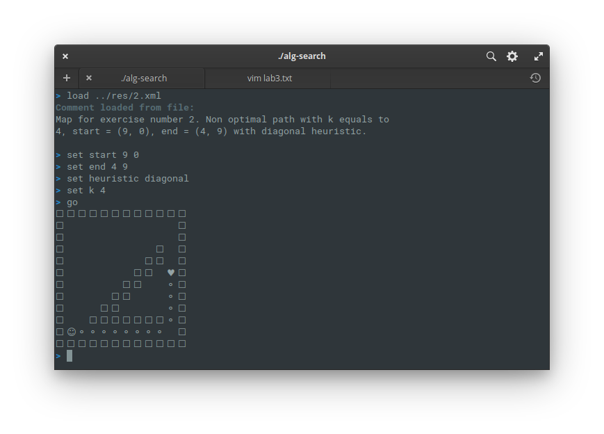
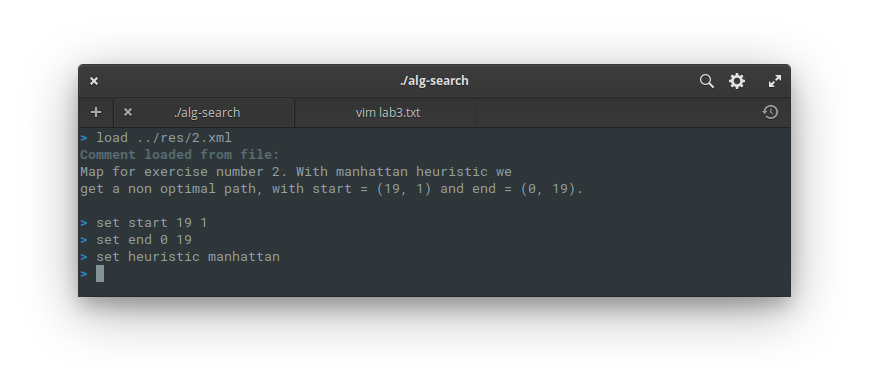
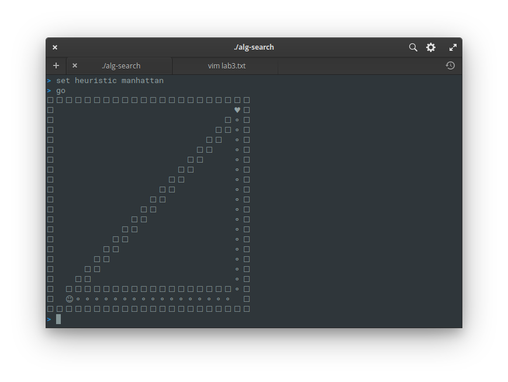
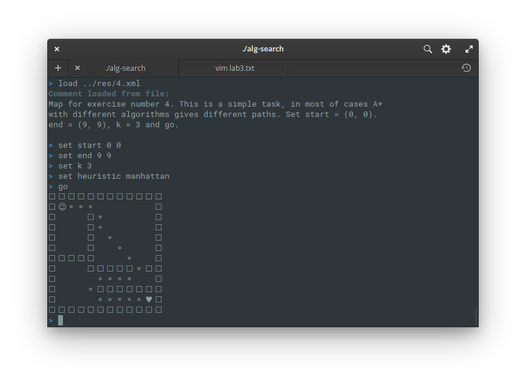
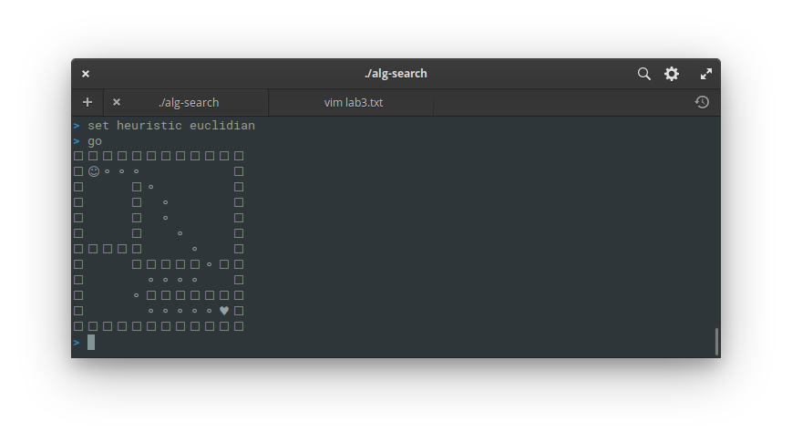

This is an educational purpose project. Feel free to explore the source code. The project is not
complete yet, so you can find some bugs. Fixes and improvements will be added in the future.

Known bugs and issues:
*  **line_of_sight** is allowing passing through the wall when the direction is strictly diagonal;
*  add a function called **path_between_nodes** to get the paths between the nodes when using Theta&ast; or k > 3;
*  the shell error messages are buggy, the current version is just a place holder (because it's not my priority now).

#### 1. Пример карты, где Theta&ast; (с k=2 или k=3) находит путь длиннее чем A* с k=5

Не найден. Я не смог придумать такую ситуацию. Я до сих пор не понимаю диагональное эвристическое поведение

#### 2. Пример карты, где A* с k = 4 находит неоптимальный путь с использованием диагональной эвристики

  

#### 3. Пример карты, где A* с k>2 находит неоптимальный путь с использованием эвристики Манхэттена.

Сначала мы загружаем карту и выбираем соответствующие значения переменных.

  

И набираем "go":

  

Как мы видим, диагональный путь ближе, чем полученный путь. Манхэттен работает таким образом, потому что эвристика вычисляет диагональное движение, как если бы это были два перпендикулярных движения. Если k равно 2, этот путь будет оптимальным.

#### 4. Пример карты, где A* с разными эвристиками(или весом эвристики) находит разные пути одникаовой стоимости

Дейкстра с манхэттенской эвристикой.

  

Дейкстра с евклидовым эвристическим.

  

Есть только немного другой путь. Но стоимости одинаковы.

